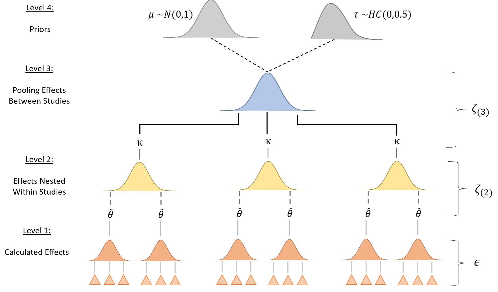
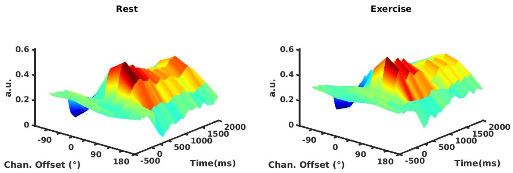
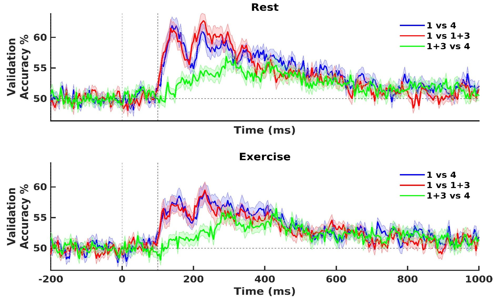
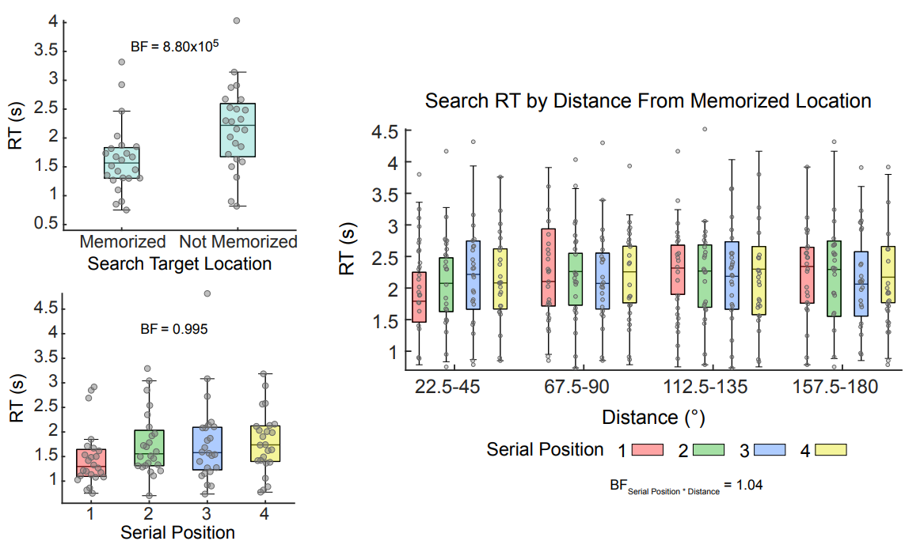

<h3 id="pacman">Probabilistic Modeling of the Impact of Exercise on Cognition</h3>

The literature of studies evaluating the effect of exercise on cognition is filled with heterogeneous results, which makes it difficult to desing effective exercise protocols. To address this issue, I conducted a Bayesian meta-analysis to synthesize data from across 113 experimental studies (651 effect sizes) and quantify the impact a single bout of exercise has on cognitive task performance. 

**Key Impacts**:

- This analysis estimated the probability that a set of exercise intervention parameters (e.g., duration, intensity, type) will have a beneficial or aversive impact on performance for a specific cognitive task.

- Provides data-driven insights for designing effective exercise interventions that selectively impact aspects of cognition

<h4>More Info:</h4>

<a href="https://www.nature.com/articles/s44271-024-00124-2" rel="noopener noreferrer" target="_blank">Paper</a>

---

<h3 id="wtf-bike">Reconstructing Working Memory Representations During Aerobic Exercise</h3>

In this study, I investigated how changes in physiological state influence working memory performance. Using an Inverted Encoding Model (IEM), I reconstructed and quantified mental representations of spatial locations retained in memory from patterns of alpha-band EEG activity across the scalp.

**Key Impacts**: 

- This study was the first to demonstrate that working memory representations could be reconstructed, quantified, and tracked during aerobic exercise.

- I implemented a cluster-based correction routine to mitigate the potential for spuriously large Bayes Factors, ensuring the findings were robust against statistical noise.

- The work reinforced the use of multivariate modeling to detect differences in neural patterns across experimental conditions that univariate approaches can fail to capture.

<h4>More Info:</h4>

<a href="https://direct.mit.edu/jocn/article/33/7/1271/98592/Tracking-the-Contents-of-Spatial-Working-Memory" rel="noopener noreferrer" target="_blank">Paper</a>

<a href="javascript:void(0)" onclick="openPoster('assets/posters/wtf-bike-poster.pdf')">Poster</a>

---

<h3 id="cda-bike">Decoding Working Memory Load From EEG</h3>

I investigated the impact of physiological arousal on the ability to selectively encode task-relevant information while ignoring environmental distractors. I conducted a linear discriminant analysis (LDA) of the topographical distributions of evoked potentials to decode high versus low working memory load. Then, I applied the trained classification model to conditions requiring distractor suppression, allowing me to determine if task-irrelevant information "contaminated" memory storage. If the model classified a distractor trial as "high load," it indicated poor filtering efficiency, whereas a "low load" classification signaled successful distractor exclusion.

**Key Impacts**:

- Demonstrated that working memory load and filtering efficiency could be successfully tracked using both univariate measures (i.e., contralateral delay activity) and multivarite classifiers during exercise.

- The project serves as a first step toward detecting the contamination of goal-relevant information in memory by distractors using a brain-computer interface.

<h4>More Info:</h4>

<a href="https://escholarship.org/uc/item/4hp7j3d4#page=116" rel="noopener noreferrer" target="_blank">Dissertation Chapter</a>

---

<h3 id="swamp">Modeling the Prioritization of Information in Working Memory</h3>

This research study aimed to determine how the human brain prioritizes multiple pieces of goal-relevant information stored in working memory. Using a sequential spatial memory task and high-precision eye-tracking, I measured how remembered locations incidentally biased attention during a secondary visual search task. While memory recall accuracy varied based on the order of information (serial position effects), the attentional "weight" of these items remained uniform. This suggests that while some memories are easier to retrieve than others, all active representations in working memory exert an equivalent influence on current behavioral priorities and environmental scanning.

**Key Impacts**:

- Quantified how internal working memory representations incidentally direct external attention, demonstrating that even task-irrelevant memory locations significantly accelerate reaction times.

- Discovered that the degree of prioritization across multiple goal-relevant representations is equivalent, challenging models that suggest a "single-item" focus of attention within memory.

- Successfully utilized eye-movement data as a high-fidelity proxy for internal cognitive state, mapping the intersection between internal memory storage and external visual behavior.

<h4>More Info:</h4>

<a href="javascript:void(0)" onclick="openPoster('assets/posters/swamp-poster.pdf')">Poster</a>

